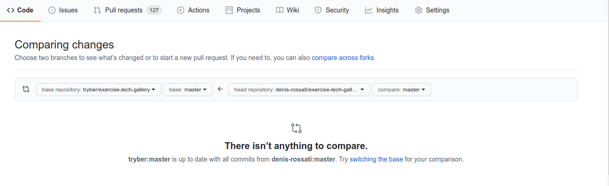
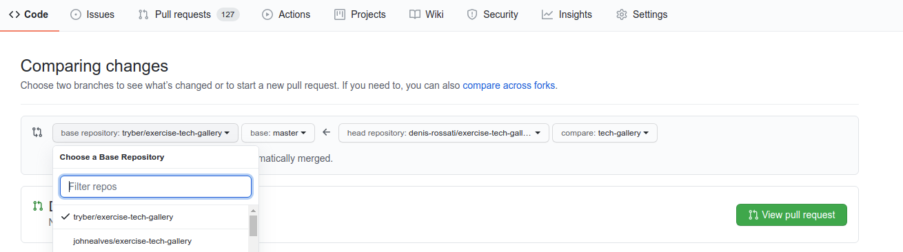
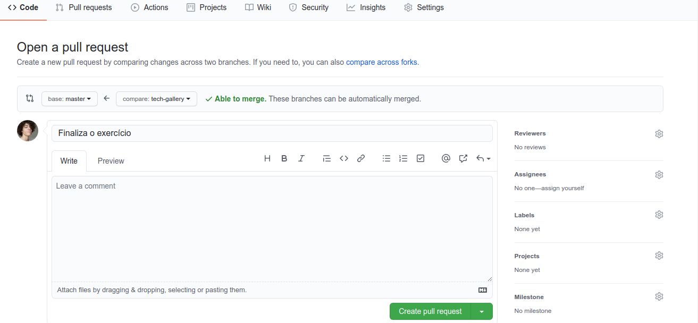
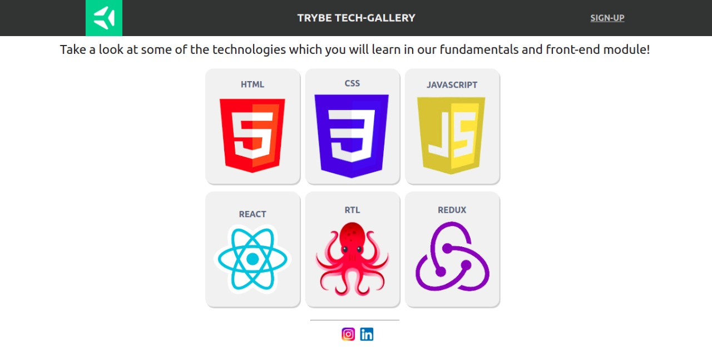
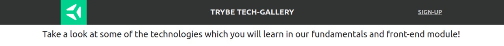
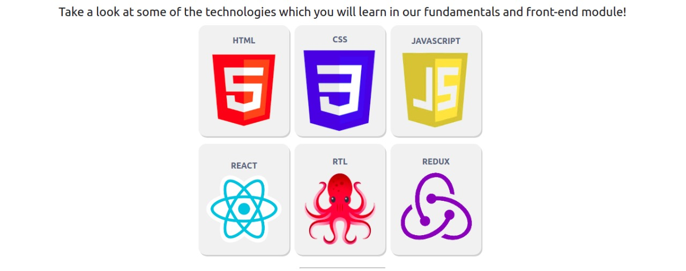

Esse é um projeto para o conteúdo de `CSS Flexbox`.

### Antes de iniciar

Crie um fork desse projeto e para isso siga esse [tutorial de como realizar um fork](https://guides.github.com/activities/forking/).

Após feito o fork, clone o repositório criado para o seu computador.

Vá para a branch master do seu projeto e execute o comando:

git branch

Mude para a branch tech-gallery com o comando git checkout -b tech-gallery. É nessa branch que você realizará a solução para o exercício.

Observe o que deve ser feito nas instruções.

Após a solução dos exercícios, abra um PR no seu repositório forkado e, se quiser, mergeie para a master, sinta-se a vontade!

**Atenção!** Quando for criar o PR você irá se deparar com essa tela:

É necessário realizar uma mudança. Clique no *base repository* como na imagem abaixo:

Mude para o seu repositório. Seu nome estará na frente do nome dele, por exemplo: `antonio/tech-gallery`. Depois desse passo a página deve ficar assim:

Agora basta criar o PULL REQUEST clicando no botão `Create Pull Request`.

Para cada PR realize esse processo.

### COMEÇANDO OS EXERCÍCIOS

#### Exercício 1
- Crie um cabeçalho para sua aplicação utilizando a tag `header`. Este cabeçalho **deve** possuir 3 elementos e estes devem ser posicionados utilizando **Flexbox**. O resultado deverá ser similar à estrutura da página "Trybe Tech-Gallery". Observe os exemplos abaixo:

#### Exercício 2
- Implemente o conteúdo da primeira `section`. Esta seção deverá conter no mínimo um elemento de texto. Utilizando **Flexbox**, faça o posicionamento de acordo com o exemplo abaixo.

#### Exercício 3
- Implemente o posicionamento da segunda `section`. Esta seção deverá conter  no mínimo 6 imagens e um título para cada uma delas. Sinta-se livre para usar a imaginação e selecionar as imagens que preferir, só não esqueça de seguir a estrutura de posicionamento proposta. 😉

#### Exercício 4
- Por fim, faça o posicionamento do footer/rodapé, este é o ultimo elemento necessário para que nossa aplicação fique completa. O rodapé **deverá** conter no mínimo 2 elementos. Para o exemplo, foram adicionadas imagens que redirecionam o usuário para as redes sociais da Trybe.

